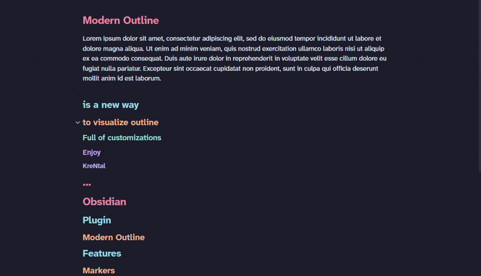

# Modern Outline

A modern minimap outline for [Obsidian](https://obsidian.md). Displays your note's headings as small horizontal dashes overlaid on the edge of the note — longer for H1, progressively shorter for deeper levels. Hover the strip to reveal the heading names; click a dash to jump.

<!-- Add a screenshot or GIF here before publishing, e.g.:

-->

## Features

- Minimal dash strip overlaid directly on the note (not in the sidebar)
- Hover the strip to reveal all heading names, with a cascade fade animation
- Active heading highlighted as you scroll — reliable in both editing and reading mode
- Click any dash to jump to that heading (works even when focus is elsewhere)
- Wheel over the outline scrolls the note normally; the strip never steals the scroll
- Adapts to dense notes: spacing compresses and the active rung stays in view
- Fully themeable: independent dash/label colors, dash shape & size, label font

## Installation

### Manual

1. Download `main.js`, `styles.css`, `manifest.json` from the [latest release](../../releases/latest)
2. Copy them into `<vault>/.obsidian/plugins/modern-outline/`
3. Reload Obsidian and enable the plugin in **Settings → Community plugins**

### Community plugin list

Coming soon.

## Settings

**Appearance**

| Setting | Default | Description |
|---|---|---|
| Horizontal position | Left | Show the strip on the left or right edge of the note |
| Vertical alignment | Center | Anchor the strip top, center, or bottom |
| Animations | On | Cascade/fade animations for dashes and labels |

**Style**

| Setting | Default | Description |
|---|---|---|
| Dash color | Monochrome | Monochrome, Accent, Colorful (per level), or Theme headings |
| Label color | Monochrome | Same options, independent from the dashes |
| Dash shape | Rounded | Rounded or Square corners |
| Dash size | Medium | Small, Medium, or Large |
| Label font | Interface | Interface, Editor text, or Monospace |

**Headings**

| Setting | Default | Description |
|---|---|---|
| Minimum heading level | 1 | Hide headings above this level |
| Maximum heading level | 4 | Hide headings below this level |

> **Theme headings** uses the heading colors defined by your active Obsidian
> theme (e.g. AnuPpuccin's `--h1-color … --h6-color`), falling back to a default
> palette when the theme doesn't define them.

## Development

```bash
git clone https://github.com/KreNtal/obsidian-modern-outline
cd obsidian-modern-outline
npm install
npm run dev       # watch mode
npm run build     # production build
```

Copy `main.js`, `styles.css`, `manifest.json` into your vault's plugin folder to test.

## License

[MIT](LICENSE)
